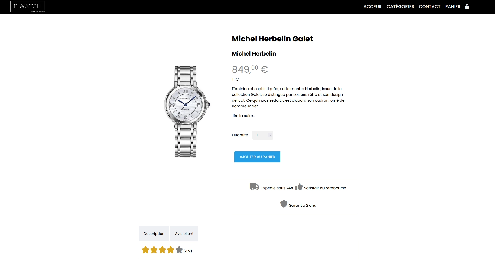

# :fr: E-WATCH : Training e-shop React App

___

This project was created when I finished my school from scratch, in order to train React's concepts, espacially the states management without third libairies. 
Sanity has been used has backend.

:star: I'm open to any code review ! Please don't hesitate.

___

:octocat: Made by : Julien Chanon

:date: Date : 18/11/2022

___

:house: Give it a try at : https://e-watch-theta.vercel.app/
___

## Do you want to see more?

You are welcome to visit my portfolio at https://julien-chanon.fr/ where you will find more of my projects and who am I.